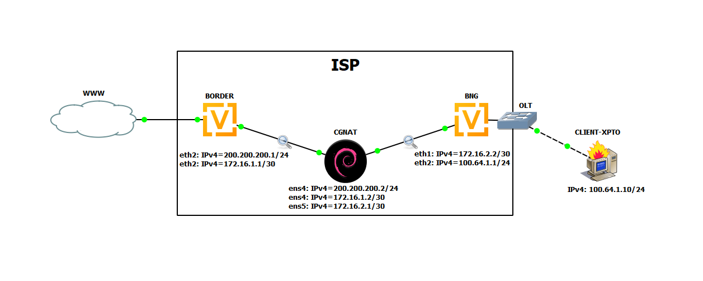

# Network cgnat

# Topology


# Building CGNAT
```bash
    git clone https://github.com/rick0x00/net_cgnat.git
    cd net_cgnat/box/generic/os/debian/native/nftables/
    vim build_cgant.sh
    bash build_cgant.sh
```
